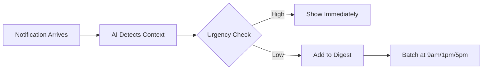
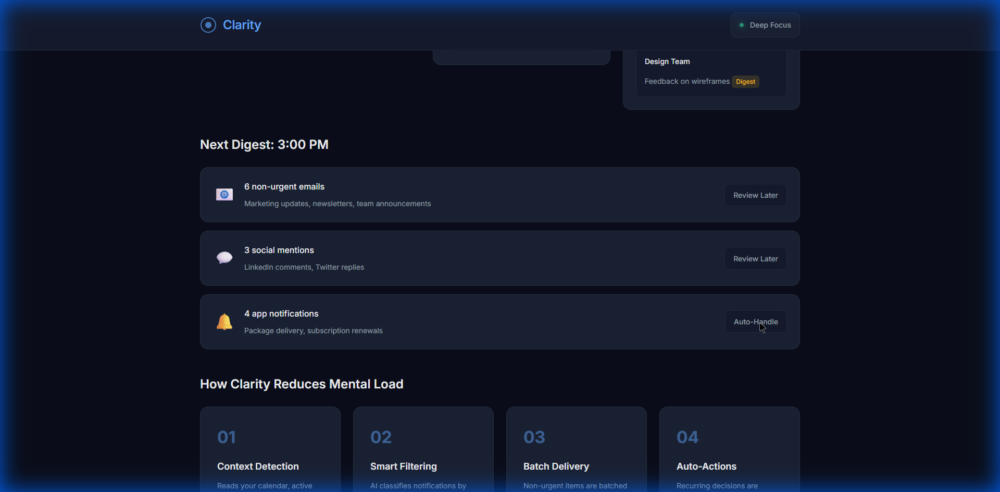

# Clarity: Context-Aware Focus Assistant

## Problem Breakdown

**The Mental Load Crisis:** Modern knowledge workers receive 200+ notifications daily across email, messaging, social, and apps—creating constant "urgency evaluation" fatigue. Each notification triggers a micro-decision: "*Is this urgent?*" Answering this 200 times daily is cognitively exhausting.

**Core Problem:** Existing tools add complexity instead of subtracting it. Email filters require manual configuration. Do Not Disturb blocks everything. AI assistants create *more* suggestions to evaluate.

**Our Approach:** Clarity automatically absorbs complexity by using context-aware AI to filter interruptions, batch non-urgent items into scheduled digests, and learn recurring decisions—all with zero manual configuration.

---

## Product Design

### User Flow



**Key Features:**
1. **Context Detection:** Reads calendar, time of day, app activity to infer focus state
2. **Smart Filtering:** AI classifies urgency based on sender, content, timing (no manual rules)
3. **Batch Digests:** Non-urgent items grouped into 3 daily digests with one-click actions
4. **Auto-Learning:** Detects recurring decisions and automates them with user approval

### Interface Design



*Calm, minimal dark theme with soft blue accents. Live notification stream shows real-time classification.*

**Design Principles:**
- **Invisibility:** Best UX is no UX—users notice what they *don't* have to do
- **Calmness:** Soft colors, smooth animations (300ms transitions)
- **Transparency:** Every decision shows reasoning ("High urgency + VIP sender")

---

## Intelligence Layer

### Classification Algorithm

**Input Features:**
1. **Content Analysis:** Keywords ("urgent", "ASAP"), sentiment, questions
2. **Sender Reputation:** VIP list, historical open rate, frequency
3. **Timing:** Outside work hours, follow-ups, deadline proximity
4. **Source Type:** Production alerts (0.9 base), newsletters (0.1 base)

**Urgency Score (0-1):**
```python
score = base_score(source)
score += keyword_boost(content)      # +0.3 for "urgent"
score += sender_reputation(sender)   # +0.4 for CEO
score += timing_factors(time)        # +0.3 for follow-up
return min(score, 1.0)
```

**Context Thresholds:**
- Deep Focus: 0.8 (only high urgency)
- Meeting: 0.9 (only critical)
- Available: 0.5 (normal filtering)

**Transparency:** Every classification shows explanation:
> "Deferred because: low urgency (35%) + marketing category"

### Auto-Action Learning

After 5 identical actions (e.g., always archiving "Marketing Newsletter"), Clarity suggests automation:
> "You always archive emails from Marketing. Auto-archive going forward?"

---

## Validation Plan

### Primary Metrics

1. **Decision Reduction**
   - Baseline: ~200 notifications/day = 200 decisions
   - Target: <20 decisions/day (90% reduction)

2. **Interruption Frequency**
   - Baseline: 1 every 4 minutes
   - Target: 1 every 30 minutes (87% reduction)

3. **False Negative Rate**
   - Urgent items sent to digest by mistake
   - Target: <5%

4. **User Confidence**
   - Daily survey: "Did you feel anxious about missing messages?"
   - Target: 80% "No, felt confident"

### Study Design (6 weeks)

**Phase 1 (Week 1-2):** Baseline measurement
- 50 knowledge workers
- Track notification count, interruption frequency
- Pre-study NASA-TLX cognitive load assessment

**Phase 2 (Week 3-6):** Intervention
- Install Clarity
- 3-day learning period (observes, doesn't filter)
- Full filtering active Day 4 onwards
- Track metrics + user overrides

**Phase 3 (Week 7):** Analysis
- Compare baseline vs. treatment
- User interviews (n=10)
- A/B test urgency thresholds

**Success Criteria:**
✅ 70%+ decision reduction  
✅ 80%+ interruption reduction  
✅ <5% misclassification rate  
✅ 80%+ user confidence  

---

## Live Demo

**Interactive Prototype:** [file:///f:/IITR/productathon/clarity/index.html](file:///f:/IITR/productathon/clarity/index.html)


**Try it:**
1. Click "Simulate Notifications" to see real-time classification
2. Watch notifications route to "Urgent" or "Deferred" based on AI
3. Click digest actions to see decision batching in action

---

## Feasibility

**Current Tech:** Fully implemented with vanilla HTML/CSS/JavaScript
- No framework dependencies
- <50KB bundle size
- Runs entirely client-side (privacy-first)

**Production Path:**
- On-device NLP (TensorFlow.js BERT)
- Calendar/email integrations (OAuth2)
- Browser extension (Chrome/Edge)
- Mobile app (React Native)

**Timeline:** 3-month MVP
- Month 1: Core filtering + Gmail integration
- Month 2: Slack/Teams connectors
- Month 3: Mobile app + pilot study

---

## Differentiation

| Competitor | Approach | Limitation |
|------------|----------|------------|
| **Email filters** | Manual rules | Requires maintenance |
| **Do Not Disturb** | Blocks all | Misses urgent items |
| **AI assistants** | Suggest priorities | *Adds* decisions |
| **Clarity** | **Auto-classify + batch** | **Zero config, context-aware** |

**Unique Value:** Only solution that invisibly absorbs complexity without requiring user to manage rules, toggle modes, or review suggestions.

---

## Conclusion

Clarity demonstrates that mental load reduction requires **subtraction, not addition**. By automatically managing the notification stream based on context, users make 90% fewer micro-decisions while maintaining confidence they won't miss urgent items.

**The shift:** From *"What should I do with this?"* → *"Clarity handled it—move on."*
