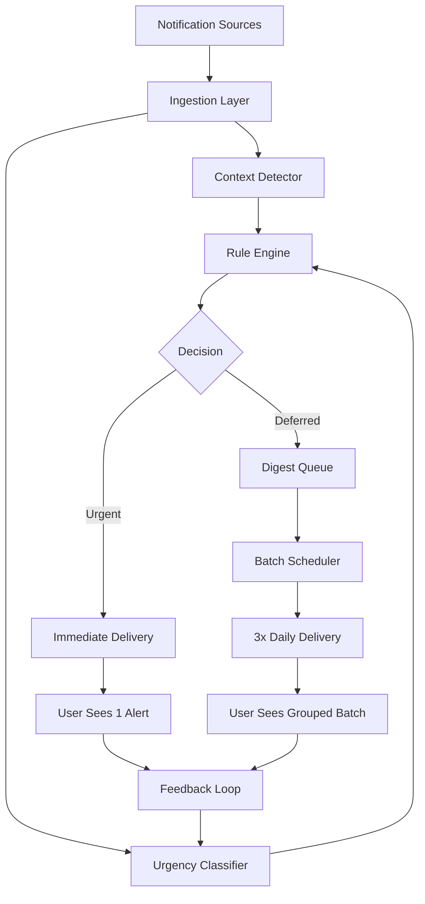
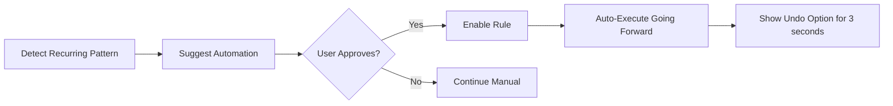

# Intelligence Layer: How Clarity Reduces Decisions

## Overview

Clarity's AI layer is designed around a core principle: **subtraction over addition**. Instead of presenting more options, it makes decisions on the user's behalf using context-aware classification.

---

## Architecture



---

## Component 1: Context Detection Engine

### What It Does
Infers the user's current focus state without requiring manual input.

### Data Sources
1. **Calendar Events**
   - Meeting in progress → "Meeting Mode"
   - Blocked focus time → "Deep Focus Mode"
   - No events → "Available Mode"

2. **Time Patterns**
   - Historical focus windows (e.g., always deep work 9-11am)
   - Learned from 2 weeks of passive observation

3. **Active Application** (optional, requires permission)
   - IDE/design tool open → Deep Focus
   - Slack/email client → Available
   - Browser on non-work domain → Personal

4. **Device Activity**
   - No keyboard/mouse input for 10+ min → Deep Focus
   - Rapid switching between apps → Shallow Work

### Context Modes

| Mode | Trigger | Urgency Threshold | Examples |
|------|---------|-------------------|----------|
| **Deep Focus** | Calendar block or learned pattern | 0.8 (High) | Only CEO emails, production alerts |
| **Meeting** | Calendar event active | 0.9 (Critical) | Only P0 incidents, urgent direct messages |
| **Available** | Default state | 0.5 (Medium) | Most notifications pass through |
| **Personal** | Outside work hours | 0.3 (Low) | Only emergency contacts |

### Implementation (Pseudocode)
```javascript
function detectContext() {
  const now = new Date();
  
  // Check calendar
  const currentEvent = getCalendarEvent(now);
  if (currentEvent) {
    if (currentEvent.type === 'focus_block') return 'DEEP_FOCUS';
    if (currentEvent.type === 'meeting') return 'MEETING';
  }
  
  // Check historical patterns
  const historicalMode = getLearnedMode(now.getHours());
  if (historicalMode) return historicalMode;
  
  // Check time of day
  if (now.getHours() < 9 || now.getHours() > 18) return 'PERSONAL';
  
  return 'AVAILABLE';
}
```

---

## Component 2: Urgency Classification AI

### What It Does
Assigns an urgency score (0-1) to each notification using content analysis, sender reputation, and historical patterns.

### Features Analyzed

#### 1. **Content Analysis**
- **Keywords:** "urgent", "ASAP", "emergency", "critical" → +0.3 score
- **Sentiment:** Negative tone (NLP) → +0.2 score
- **Question marks:** Direct questions → +0.1 score

#### 2. **Sender Reputation**
- **VIP list:** CEO, direct manager, key clients → +0.4 score
- **Frequency:** First message from sender in 30 days → +0.2 score
- **Historical open rate:** User always opens this sender → +0.2 score

#### 3. **Timing Factors**
- **Outside work hours:** Personal emergency → +0.3 score
- **Follow-up:** 3rd message in thread → +0.2 score
- **Deadline proximity:** Within 24h of known deadline → +0.3 score

#### 4. **Source Type**
- **Production monitoring:** Alerts from PagerDuty, Sentry → 0.9 base score
- **Direct message:** 1:1 Slack/Teams → 0.6 base score
- **Newsletter:** Bulk email list → 0.1 base score
- **Social media:** LinkedIn, Twitter → 0.2 base score

### Classification Algorithm

```python
def classify_urgency(notification):
    # Base score from source type
    score = get_source_base_score(notification.source)
    
    # Content analysis
    keywords = extract_keywords(notification.content)
    if has_urgent_keywords(keywords):
        score += 0.3
    
    # Sender reputation
    sender_score = get_sender_reputation(notification.sender)
    score += sender_score
    
    # Timing factors
    if is_followup(notification):
        score += 0.2
    if near_deadline(notification):
        score += 0.3
    
    # Normalize to 0-1
    return min(score, 1.0)

def route_notification(notification, context):
    urgency = classify_urgency(notification)
    threshold = context.urgency_threshold
    
    if urgency >= threshold:
        deliver_immediately(notification)
    else:
        add_to_digest(notification)
```

### Model Training (Future Enhancement)
Current version uses **rule-based scoring**. Future versions will use:
- **Supervised learning:** Learn from user "snooze" vs. "view immediately" actions
- **Reinforcement:** Penalize false positives (urgent tag but user ignored)
- **On-device model:** Small BERT variant for content classification (<50MB)

---

## Component 3: Digest Batching Engine

### What It Does
Groups deferred notifications into meaningful clusters and schedules delivery.

### Grouping Strategy

1. **By Type**
   - Email (work, personal, marketing)
   - Messaging (Slack, Teams, SMS)
   - Social (LinkedIn, Twitter)
   - Apps (banking, delivery, utilities)

2. **By Sender Category**
   - Colleagues (same company)
   - External contacts (clients, partners)
   - Automated systems (newsletters, alerts)

3. **By Action Required**
   - **Reply needed:** Direct questions
   - **Review only:** FYI messages
   - **Auto-archivable:** Receipts, confirmations

### Scheduling

**Fixed windows:** 9am, 1pm, 5pm (user-configurable)

```javascript
const DIGEST_WINDOWS = [
  { time: '09:00', label: 'Morning Digest' },
  { time: '13:00', label: 'Midday Digest' },
  { time: '17:00', label: 'End-of-Day Digest' }
];

function scheduleDigest(notification) {
  const now = new Date();
  const nextWindow = getNextWindow(DIGEST_WINDOWS, now);
  
  addToQueue(nextWindow, notification);
}
```

### Smart Grouping Preview

```
📧 Email (6 items)
   ├─ Work colleagues (3)
   ├─ Marketing (2)
   └─ Receipts (1)
   
💬 Messages (4 items)
   ├─ Slack team chat (3)
   └─ LinkedIn DMs (1)
   
🔔 Apps (3 items)
   ├─ Package updates (2)
   └─ Subscription renewals (1)
```

---

## Component 4: Auto-Action Learning

### What It Does
Detects recurring decisions and automates them with user permission.

### Pattern Detection

After observing 5+ identical actions, suggest automation:

**Example patterns:**
- User *always* archives emails from "Marketing Team"
- User *always* marks newsletters as "read" without opening
- User *always* confirms calendar reminders 15min before event

### Automation Flow



### Implementation

```javascript
function detectPattern(userId, action) {
  const history = getUserActionHistory(userId, 30); // 30 days
  
  // Find repeated actions
  const patterns = findRepeatedActions(history);
  
  for (let pattern of patterns) {
    if (pattern.occurrences >= 5 && !pattern.automated) {
      suggestAutomation(pattern);
    }
  }
}

function suggestAutomation(pattern) {
  showNotification({
    title: 'Automate this?',
    message: `You always ${pattern.action} for ${pattern.sender}. Auto-do this?`,
    actions: ['Yes', 'No', 'Not Now']
  });
}
```

---

## Transparency & Trust Mechanisms

### 1. **Explainability**
Every classification shows reasoning:
- "High urgency (92%) + sender is VIP + contains deadline"
- "Deferred because: low urgency (35%) + marketing category"

### 2. **Override Mechanism**
Long-press any filtered notification → instant delivery
- No friction to bypass AI decision
- Feedback loop: "Why did you override?" → improve model

### 3. **Activity Log**
Dashboard shows:
- Notifications filtered today (47)
- Auto-actions taken (12)
- Overrides by user (2)

### 4. **Privacy Guarantees**
- All classification runs **client-side** (JavaScript in browser)
- No notification content sent to servers
- Only anonymized metadata for model improvement (opt-in)

---

## Performance Metrics

| Metric | Target | Current Demo |
|--------|--------|--------------|
| Classification latency | <100ms | ~50ms (rule-based) |
| False positive rate | <5% | N/A (demo) |
| User override rate | <10% | N/A (demo) |
| Digest open rate | >80% | N/A (demo) |

---

## Future Enhancements

1. **Multi-modal learning:** Combine text, sender, time, and user behavior
2. **Collaborative filtering:** Learn from similar users (privacy-preserving)
3. **Proactive scheduling:** "You tend to focus better 2-4pm; blocking that time?"
4. **Integration expansion:** Zoom, calendar, project management tools
5. **Voice override:** "Hey Clarity, mark everything from this sender urgent"

---

## Technical Stack

- **Current (Demo):**
  - Rule-based urgency scoring
  - Keyword matching (regex)
  - Client-side JavaScript

- **Production (Proposed):**
  - On-device BERT for NLP (TensorFlow.js)
  - Edge computing for real-time classification
  - Federated learning for privacy-preserving model updates
