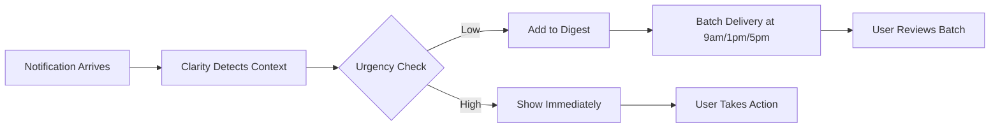
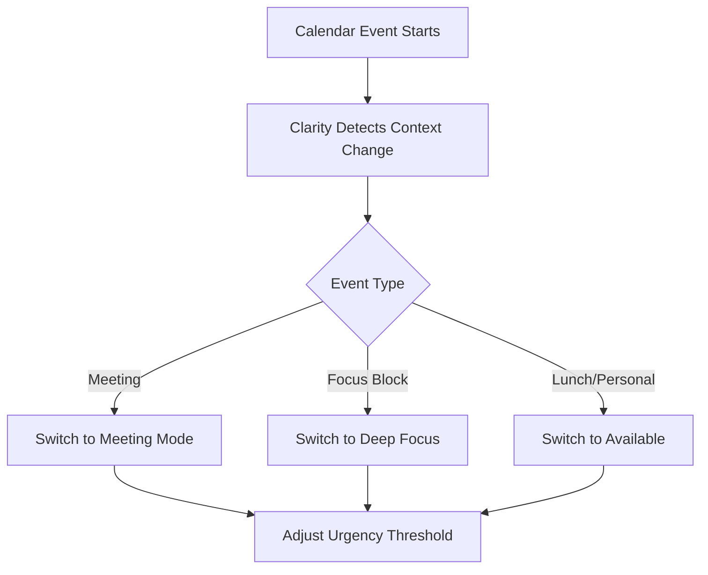
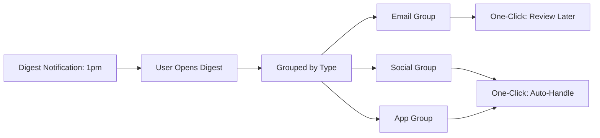

# Product Design: Clarity

## Design Philosophy

Clarity follows three core principles:
1. **Invisibility:** Best UX is no UX—users should notice only what they *don't* have to do
2. **Calmness:** Soft colors, minimal motion, respectful interactions
3. **Transparency:** Always show *why* a decision was made, with one-click override

---

## User Personas

### Primary: Maya, Product Manager
- **Pain:** 150+ notifications/day across email, Slack, calendar, project tools
- **Need:** Uninterrupted 2-hour focus blocks for strategy work
- **Behavior:** Currently uses DND mode, but misses urgent client messages

### Secondary: Dev, Software Engineer
- **Pain:** Production alerts mixed with social/marketing noise
- **Need:** Immediate alerts for critical issues, silence for everything else
- **Behavior:** Disables most notifications, then misses calendar invites

---

## Core User Flows

### Flow 1: Automatic Notification Filtering



**Steps:**
1. Notification arrives from any source (email, Slack, app)
2. Clarity reads current context (calendar = "Focus Block 2-4pm")
3. AI classifier evaluates urgency (email from CEO = high, newsletter = low)
4. High-urgency items appear as single alert; low-urgency batched to next digest
5. User sees only what's urgent; batch review happens 3x daily

**Key Insight:** User makes 1 decision (review digest) instead of 50 individual decisions.

---

### Flow 2: Context-Aware Mode Switching



**Steps:**
1. User's calendar shows "Design Review 2-3pm"
2. Clarity automatically enters "Meeting Mode" at 2pm
3. Urgency threshold raised to 0.9 (only critical alerts)
4. At 3pm, event ends → switches to previous mode
5. No manual toggling required

**Key Insight:** Zero user input; context is inferred from existing data sources.

---

### Flow 3: Digest Review & Batch Actions



**Steps:**
1. At scheduled time (1pm), single notification: "13 items in your digest"
2. User opens digest interface
3. Items pre-grouped (emails, social, app notifications)
4. Each group has contextual action: "Review Later" or "Auto-Handle"
5. One click processes entire group

**Key Insight:** Transform 13 decisions into 3 batched actions.

---

## Interface Wireframes

### Main Dashboard (Desktop)

```
┌─────────────────────────────────────────────────────────┐
│ ◉ Clarity          [Context: Deep Focus] 🟢             │
├─────────────────────────────────────────────────────────┤
│                                                         │
│   Technology that thinks less, so you don't have to    │
│   Clarity absorbs digital chaos and returns only       │
│   what matters—when it matters.                        │
│                                                         │
│  ┌─────────────┐ ┌─────────────┐ ┌─────────────┐      │
│  │     47      │ │    3.2h     │ │     12      │      │
│  │ Blocked     │ │ Focus Time  │ │ Auto-Actions│      │
│  └─────────────┘ └─────────────┘ └─────────────┘      │
│                                                         │
│  Current Context                                        │
│  ┌─────────────────────────────────────────────┐       │
│  │ Mode: Deep Focus                             │       │
│  │ Until: 3:00 PM                               │       │
│  │ Calendar: Design Review                      │       │
│  │ Filter: High Priority Only                   │       │
│  └─────────────────────────────────────────────┘       │
│                                                         │
│  Live Notification Stream          [Simulate ▶]        │
│  ┌──────────┐  ⟹  ┌─────────┐  ┌──────────┐          │
│  │ Incoming │  AI  │ Urgent  │  │ Deferred │          │
│  │          │      │ Show Now│  │  Digest  │          │
│  │ • CEO    │      │ • CEO   │  │ • Newsletter        │
│  │ • Newsletter    │         │  │ • LinkedIn          │
│  └──────────┘      └─────────┘  └──────────┘          │
│                                                         │
│  Next Digest: 3:00 PM                                  │
│  📧 6 non-urgent emails     [Review Later]             │
│  💬 3 social mentions        [Review Later]             │
│  🔔 4 app notifications      [Auto-Handle]             │
│                                                         │
└─────────────────────────────────────────────────────────┘
```

### Mobile Digest View

```
┌──────────────────────┐
│ ◉ Clarity       🟢   │
├──────────────────────┤
│ Deep Focus           │
│ Until 3:00 PM        │
├──────────────────────┤
│                      │
│ Next Digest Ready    │
│                      │
│ 📧 Emails (6)        │
│ Marketing, team      │
│ announcements        │
│ [Review Later]       │
│                      │
│ 💬 Social (3)        │
│ LinkedIn, Twitter    │
│ [Review Later]       │
│                      │
│ 🔔 Apps (4)          │
│ Deliveries, bills    │
│ [Auto-Handle]        │
│                      │
└──────────────────────┘
```

---

## Interaction Patterns

### 1. Notification Animation
- **Incoming:** Soft slide-in from left (300ms ease-out)
- **Classification:** Pause 1.5s (AI processing indicator)
- **Routing:** Fade + slide to appropriate column (250ms)
- **Rationale:** Smooth motion builds trust; visible delay shows "thinking"

### 2. Context Indicator
- **Visual:** Small dot + text in header
- **States:** 
  - 🟢 Green (Deep Focus) 
  - 🟡 Yellow (Available) 
  - 🔴 Red (Meeting)
- **Animation:** Subtle pulse (2s loop)
- **Rationale:** Persistent reminder of current mode without being intrusive

### 3. Digest Cards
- **Grouping:** By type (email, social, app)
- **Preview:** Count + 2-3 word summary
- **Actions:** Two max per group (Review / Auto-Handle)
- **Rationale:** Reduce choice paralysis—clear, binary decisions

### 4. Override Mechanism
- **Implementation:** Long-press on any filtered notification
- **Result:** Instant delivery to "Urgent" column
- **Feedback:** Haptic + visual bounce
- **Rationale:** User always has final say; transparency builds trust

---

## Design System

### Color Palette
- **Primary:** `#60a5fa` (Calm blue)
- **Background:** `#0a0e1a` (Deep navy)
- **Text:** `#f3f4f6` (Soft white)
- **Success:** `#34d399` (Muted green)
- **Warning:** `#fbbf24` (Warm amber)
- **Urgent:** `#f87171` (Gentle red)

### Typography
- **Font:** Inter (Google Fonts)
- **Scales:** 
  - Hero: 3rem/700
  - Headers: 1.5rem/600
  - Body: 1rem/400
  - Small: 0.875rem/400

### Spacing
- **Base unit:** 8px grid
- **Card padding:** 24px
- **Section gaps:** 48px

### Micro-Animations
- **Button hover:** Transform up 1px + glow (150ms)
- **Card hover:** Border brightness increase (250ms)
- **Status pulse:** Opacity 1 → 0.7 → 1 (2s loop)

---

## Accessibility

- **WCAG AAA contrast** on all text
- **Keyboard navigation** for all actions (Tab/Enter/Space)
- **Screen reader labels** on all interactive elements
- **Reduced motion** media query removes animations
- **Color-blind safe** palette (tested with Stark plugin)

---

## Technical Implementation Notes

- **Framework:** Vanilla HTML/CSS/JS (no framework overhead)
- **Bundle size:** <50KB total
- **Performance:** 60fps animations on mid-range devices
- **Offline:** Service worker caches UI; syncs when online
- **Privacy:** All classification runs client-side (no data leaves device)
